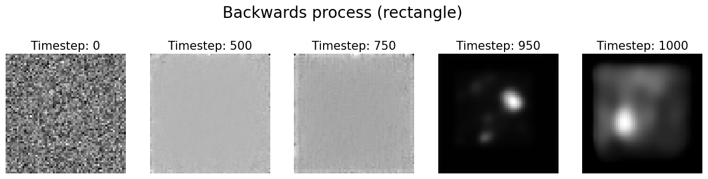

# Project title: Basic Diffusion Model for Simple Geometric Shape Generation

## Overview
This repository contains a basic conceptual demonstration of a Denoising Diffusion Probabilistc Model (DDPM) implemented using PyTorch. The proroject focuses on generating two simple 2D geometric shapes (rectangles, circles)  from random noise, showcasing a foundational understanding of diffusion-based generative models. This work serves as a practical exploration of AI methods relevant to many mainstream generative models such as Stable diffusion and DALL-E

## Project Goals
The primary objectives of this project were to:

* Generate a synthetic dataset of simple geometric shapes using Python's `OpenCV` and `NumPy`.
* Implement a simplified DDPM from scratch in PyTorch, covering the forward (noising) and reverse (denoising) processes.
* Develop a U-Net architecture as the noise prediction network, incorporating timestep conditioning.
* Train the diffusion model on the generated dataset.
* Demonstrate image generation by sampling from pure noise and iteratively denoising.
* Document the process and findings in a clear, concise Jupyter Notebook.

## Technical Details
* **Dataset Generation**: A custom script generates a dataset of 64x64 grayscale images featuring cicles and squares that are placed randomly within certain boundaries. 
* **Diffusion Process**:
    * **Forward Diffusion**:
    * **Backward Diffusion**:
* **U-Net**:
    * A U-Net architecture is used as the backbone for predicting the noise at each timestep
    * It features a encoder-decoder structure with skip connections to preserve fine details.
    * **Timestep Conditioning:** The model is conditioned on the timestep by passing the timestep t through a small MLP and injecting it into the U-Net's bottleneck layer by addition, which allows the model to adapt the predicted noise depending on the timestep.
* **Training**: The model is trained by minimizing the Mean Squared Error (MSE) between the predicted noise and the noise added during the forward pass.

## Results and Discussion
The ´diffusion_patterns.ipynb´notebook provides a setp by step walkthrough of the implementaion, including visualizations of:
* Examples from the generated datasets
* The Forward Diffusion proces
* **Generated samples** from the trained diffusion model at the final timestep as well as some intermediate timesteps. While the generated images are simple and a bit blurry, the demonstrate the model's ability to learn and generate images similar to that of the treaining data.
